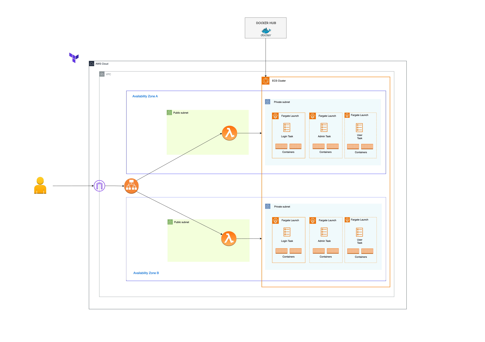

# GenAI-PDFInteraction

The application simplifies working with PDF documents by integrating advanced AI technology. It allows users to interact with PDFs through an intuitive Q&A format, making it easier to access and understand complex information.

## Key Benefits

- **Streamlined Document Interaction**: Access and retrieve information from PDFs quickly and efficiently.
- **AI-Powered Responses**: Get accurate answers to your queries using Claude LLM via Bedrock.

## Use Cases

### Help tech-teams analyze technical documentation

- Provides a way for new hires to query technical documents and workflows, facilitating a smoother onboarding process.

### Legal Document Analysis (Ex: Lease Agreements)

- Enables users to extract and understand key clauses and terms without needing to manually sift through the entire document.

### Research Paper Interaction

- Allows users to ask questions about specific sections or concepts in the paper, aiding in comprehension and analysis.

## Functionality

### Admin Features

- **Upload PDFs**: Admins can upload PDF documents into the system.
- **Create Vector Embeddings**: Admins can generate vector embeddings from the uploaded PDFs.
- **Store FAISS Vector Stores**: The vector embeddings are stored in an FAISS Vector store located in an S3 bucket.
- **Checkpoint Management**: Checkpoints are stored in a DynamoDB table to allow resumption of processing in case of failures.

### User Features

- **PDF Selection**: Users can select a PDF to initiate the Q&A process.
- **Query Submission**: Users can send queries through the application.
- **Receive Responses**: Responses are provided by the Claude 2 LLM.

Only admins have the capability to upload material to ensure security and maintain quality control over the documents being processed.

## Application Architecture

## AWS Architecture (Initial)

